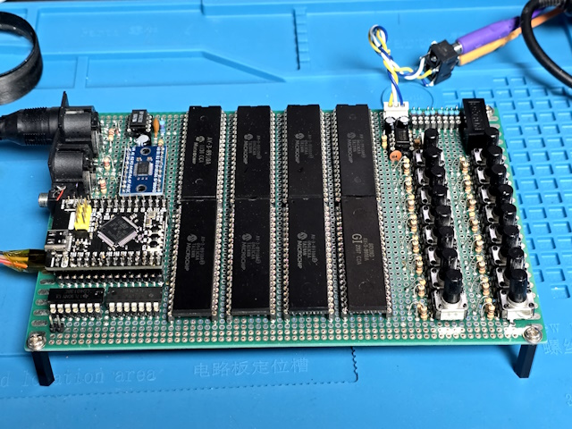
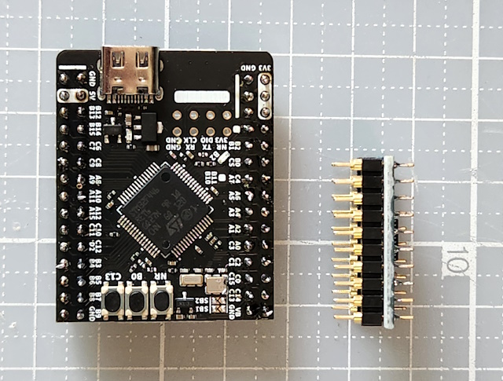
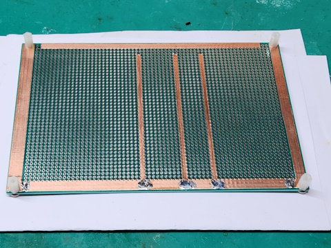
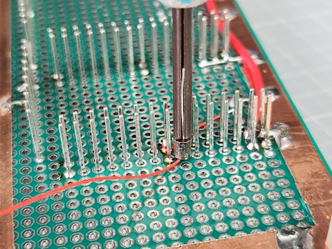

# Retro Sound Generator

Retro Sound Generator (RSG) is a project that uses 8 AY-3-8910 chips and an STM32F446 board to generate retro sounds. This device supports MIDI input and output and can play retro polyphonic sounds ranging from 8 to 24 voices.

## 1. Key Features ✨

- **8-Channel Sound Support**: Generates rich sounds using 8 AY-3-8910 chips.
- **MIDI Input and Output**: Play and control via MIDI interface.
- **2-Channel Output**: Uses two analog mixers to distribute sound output.
- **STM32F446 Board**: Uses STM32F446 MCU as the main processor.
- **Automatic Music Generation**: Can be used as a platform for automatic music generation with simple algorithms.

## 2. Hardware Configuration 🛠️

- Refer to Circuit Diagram

## 3. Build Environment 🚀

- STM32CubeIDE

## 4. Demo Video 🎥

- Coming Soon

## License 📄

This project is licensed under the [MIT License](LICENSE).

## Do not Contact 📧

sigsaly@naver.com

Below is a brief explanation of the build process.

1. **Use of STM32F446 Board Module**

   

2. **Power line work using copper tape**

   

3. **Wire wrapping**

   
